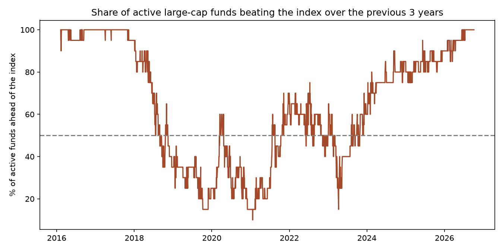

# Active vs. index: do Indian large-cap funds beat a Nifty 50 index fund?

**Question:** If you put money into an actively managed large-cap mutual fund in India instead of a cheap Nifty 50 index fund, did you do better?

**Short answer:** Over 2013–2026, yes: 19 of 20 surviving active large-cap funds beat the UTI Nifty 50 Index Fund. But it is **streaky**, and the full-period number flatters active funds because of **survivorship bias**. Active funds won almost every 3-year window up to 2018, then most of them *lost* to the index from 2019 to 2021, and they have been winning again since 2024.

<!-- latest -->
**Latest data: 06 Oct 2026.** Over 13.7 years, the Nifty 50 index fund returned 11.16% a year; 19 of 20 surviving active funds beat it. Right now, 100% of active funds are ahead of the index over the past 3 years.
<!-- /latest -->

## Data

- Daily NAVs for every **direct plan, growth option** large-cap fund, from [api.mfapi.in](https://www.mfapi.in/) (AMFI data). That is 43 funds, including 9 that closed or merged.
- Benchmark: **UTI Nifty 50 Index Fund (Direct, Growth)**. Using a real index fund instead of the index itself means the benchmark pays real fees and tracking error, as an investor would.
- Period: 8 Jan 2013 (when direct plans started) to 1 Oct 2026, 13.7 years.

## Data-integrity checks

`output/data_checks.csv` checks every fund for missing NAVs, zero or negative NAVs, duplicate dates, daily moves over 15%, and whether the fund is still running.

- One **Axis Large Cap NAV of 0.0 on a Sunday** (7 Apr 2013) was a data-entry error that turned the fund's max drawdown into −100%. Dropped.
- A **−68% one-day move in ING Large Cap** (Mar 2014) is the NAV being reset to 10.0 as the fund wound down. It's a closed fund, so it's outside the comparison.
- JM Large Cap's unusually small 2020 drawdown (−19.8% vs. −38% for the index) looked suspicious, but checking the NAVs confirms it is real: the fund lost far less than the index during the March 2020 crash.

## Results

| Measure | Nifty 50 index fund | Active funds |
|---|---|---|
| CAGR, 2013–2026 | 11.05% | median ~12.7%; 19 of 20 beat the index |
| CAGR, last 5 years | 6.06% | median 8.4%; 17 of 20 beat the index |
| Sharpe ratio (risk-free 6.5%) | 0.28 | all but one higher |
| Share of rolling 3-year windows the median fund beat the index | | 65% |

**When active funds won and lost** (share of active funds ahead of the index over the previous 3 years):



| Year | 2016–17 | 2019–21 | 2023 | 2025–26 |
|---|---|---|---|---|
| Active funds ahead | ~98% | ~30% | 47% | ~90% |

Charts in `images/`: `growth_of_1_lakh.png`, `rolling_win_rate.png`, `share_ahead_over_time.png`.

## Limitations (read before trusting the headline)

- **Survivorship bias.** The comparison only includes the 20 active funds that existed for the whole period. Nine large-cap funds closed or merged, and closed funds are usually the weaker ones, so the true "active win rate" for an investor in 2013 is lower than 19 of 20.
- **One benchmark.** UTI's index fund carries its own fee (about 0.2%) and tracking error. A different index fund, or the Nifty 50 TRI, would shift the numbers slightly.
- **Picking the winner in advance is the hard part.** Even where most active funds won, an investor in 2018 would have had to pick a fund that went on to win, and from 2019 to 2021 most did not.
- No taxes, exit loads or regular-plan commissions are included. Regular plans charge about 0.5–1% a year more and would beat the index far less often.

## Business takeaway

For an investor choosing a single large-cap fund, the index fund is the **safe default**: it costs the least and needs no fund-picking skill. Active large-cap funds have added value in India over this period, unlike the US, where most fail to. But the advantage comes in long cycles and is overstated by the funds that quietly closed.

## Automated refresh

A scheduled GitHub Actions workflow (`.github/workflows/daily-refresh.yml`) downloads the latest NAVs every weekday, reruns the data checks and analysis, and commits the updated tables, charts and the "Latest data" line above, but only when something changed.

## Reproduce

```bash
pip install pandas matplotlib
python fetch_data.py   # downloads NAVs to data/
python analysis.py     # checks, scorecard, rolling windows, charts to output/
```
